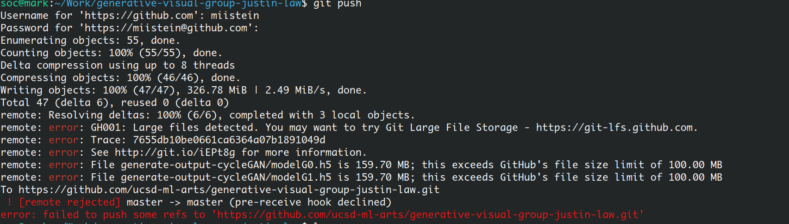

** note: sorry Professor, this is 5 hours late because of the following screenshot which I did not realize means that the repository was not pushed (didn't check github). Problem was solved by hosting keras checkpoints on google drive. **

# Project 4 Generative Visual

Justin Law, jklaw@ucsd.edu

## Abstract

Ever wondered how William Blake would paint/color in a boat riding away on the sunset? Probably not, but this cycleGAN exploits the unique coloring of William Blake and thousands of examples from open source paintings to answer this. The idea for this project was to use the CycleGAN from class to capture the edges/coloring scheme of some of my favorite William Blake sketches. The CycleGAN was unchanged, but trail and error was used to find images that cause the loss to converge for the CycleGAN dataset. What worked best was similar coloring schemes and/or high contrast (as in many different colors) and lots of edges. The results were suprisingly good for 100 epochs, 20 iterations each. See the png files without a directory for results.

## Model/Data

Briefly describe the files that are included with your repository:

- trained models
	- The trained models are in the directory generate-output-cycleGAN. See the ipython notebook for instructions on how to load the models.
- training data (or link to training data)
	- for training data, www.blakearchive.org and www.robots.ox.ac.uk/~vgg/data/paintings/ were used for William Blake and the boats respectively. download.py in the dataset_paintings directory is used to scrape the paintings and more than the boats are downloaded.
## Code

Your code for generating your project:
- The notebook generate-output-cycleGAN/CycleGAN-keras.ipynb is all that is needed to generate the results.

## Results

Documentation of your results in an appropriate format, both links to files and a brief description of their contents:
- See the png files without a directory

## Technical Notes

Any implementation details or notes we need to repeat your work. 
- To download the dataset, tensorboard is required

## Reference

References to any papers, techniques, repositories you used:
- Based on https://github.com/junyanz/CycleGAN
- As described in the Abstract, high contrast images for William Blake work the best
